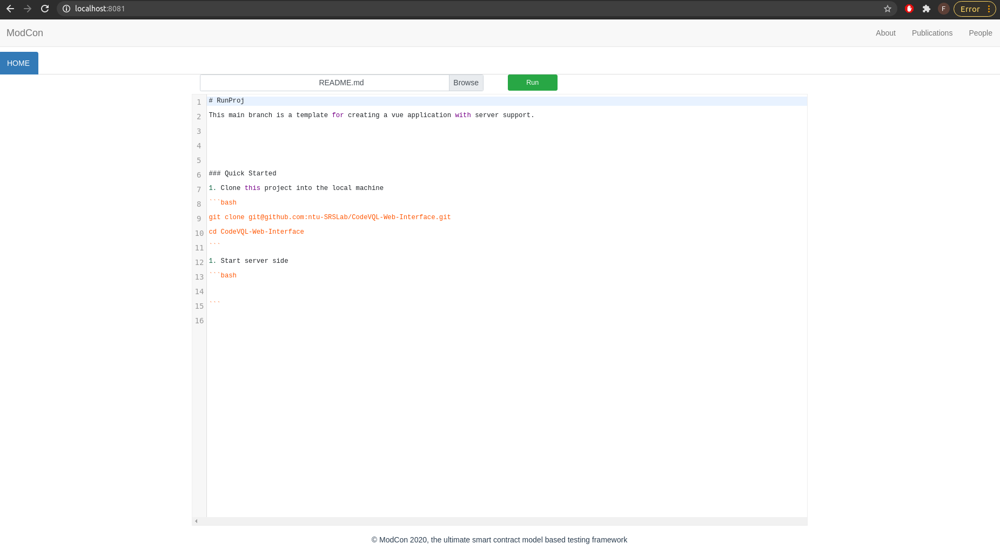
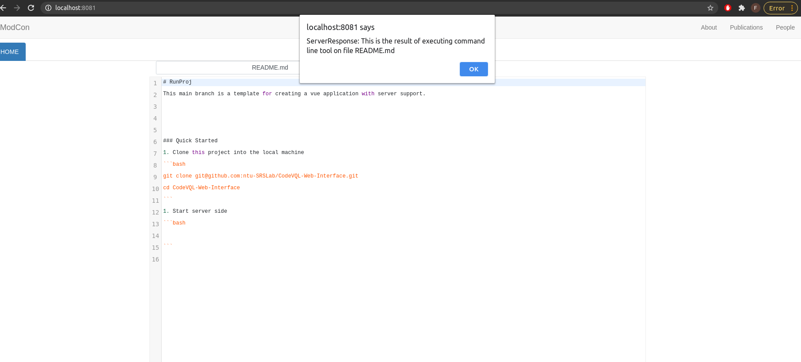

# EvoMe Web Interface
This main branch is a template for creating a vue application with server support.


### Quick Started
1. Clone this project into the local machine
```bash
git clone git@github.com:ntu-SRSLab/CodeVQL-Web-Interface.git
cd CodeVQL-Web-Interface
```
2. Start server side
```bash
cd server 
npm install     ### install dependency
node server.js  ### start server
```
3. Start vue application
```bash
cd app 
npm install       ### install dependency
npm run serve     ### start vue 
```
Here, open http://localhost:8081/, and then browser a local file, you will have something like this.

When you click ''Run'' button, you will get:


If everything goes well, you can try to integrate your command line tool within the server side code.

### Integration with the Command Line Tool
I have prepare a template within "server/server.js". You can try to integrate your tool at the specified place.
```javascript
io.on('connection', socket => {
     // your server logic 
  function server(testedfile){
    // (invoke your command line tool and return the output)
    // output = shell.exec(...cmd)
    output = "This is the result of executing command line tool on file " +testedfile;
    socket.emit(ServerResponse, output);
  }
  ...
}
```
### Structure
```
app
  --src  this directory contains vue application source code.
server
  --server.js  this single file includes all the server code.
```

### Others
Please feel free to customize the vue application. Currently it seems a little simple.

### Contacts
Please email to li0003ye@e.ntu.edu.sg if you have any question.

